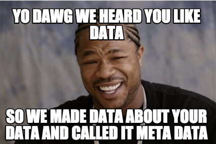

# PrivacyCommand

+ [What is meta data?](#whatis)
+ [What's the big deal with meta data?](#bigdeal)
+ [The game and visualizating meta data](#thegame)
+ [What we can do IRL](#irl)
    + [Minimizing meta data](#minimizing)
    + [Learn more](#learn)

PrivacyCommand is a game to that demonstrates how we all constantly generate personal data online and the steps we can all take to eliminate sources that undermine our privacy. It is based on the game from Terminator 2 with a privacy twist.

## So what is meta data?

Anytime you use the Internet, whether it is a computer, smartphone, tablet or other connected device, you are generating meta data. Meta data is data about our data. If this sounds like a familiar meme, allow me:

Some [examples of meta data](https://en.wikipedia.org/wiki/meta data#Definition) include:

+ Purpose of the data
+ Time and date of creation
+ Creator or author of the data
+ Location on a computer network

For example, let's say you visit a website and provide personal information... even if you use a secure HTTPS connection, someone snooping on you could see what websites you visit, the time you visit, and even your own IP address, which can be used to expose your location.

Imagine you have a cafe or bar, and I frequently find myself across the street from that meeting place. I may not be able to hear conversations you have, but through the windows, I see when you visit, how often you visit, and with whom you have conversations. Doing this in person would border on rude or creepy; given some circumstances, it is outright dangerous. If this sounds like surveillance, that's because [meta data is surveillance](https://www.schneier.com/blog/archives/2014/03/metadata_survei.html).

## What's the big deal with meta data?

As with many other things, with meta data knowledge is power. With typical interactions, the knowledge is nominally 1 to 1 -- both parties know roughly the same information about each other. What's different with meta data is whoever collects meta data have knowledge about us, whereas we have no meta data on our collectors. Data can be utilized to influence or even coerce and in this one-sided dynamic, we are powerless.

For most of us, our data is the most valuable thing we bring to the Internet. A growing number of companies are mining our meta data to productize and profit. To reframe the number one rule of the Internet: **if you don't pay for a product, you (and your data) are the product.**

Like any other data, meta data is not intrinsically harmful or dangerous -- but without policy to govern how meta data may and may not be used, every person on the Internet is impacted negatively by collection of their meta data. In 2009, [a state supreme court in the United States ruled that meta data is a matter of public record](http://archive.azcentral.com/arizonarepublic/local/articles/2009/10/30/20091030meta data1030.html). Without well-informed policy, all meta data that we generate is subject to this type collection.

## The game & visualizing meta data 

Now that we have a better understanding of what the game is about, let's take a look! Below is a screen shot of the game. The squares represent the meta data you generate, just like in real life. The difference here is that you can click on the squares to help reduce your meta data foot print!

_Data leakage is everywhere! In this game, the squares represent both critical data and redundant data. We want to keep the critical, but scrub the redundant! Try to destroy the redundant data while maintaining you critical data. The larger the score the better! Negative means you have too much redundant data!_

Clicking on the game info will provide more information:

On the right, clicking on Google, Facebook, or third-party cookies means that you are using those services on the the Internet. Clicking on the privacy tools can help you rein in your meta data.

## What we can do IRL

There are things we can do to minimize the impact of our meta data footprint.

### Minimizing meta data

Try these privacy-focused services:

+ **VPN** (internet connection): Virtual private networks are a great way to obscure your IP address, location, and encrypt your traffic. [There are many options](https://thatoneprivacysite.net/vpn-comparison-chart/) you can go with.
+ **Tor Browser** (web browser): while not best suited for a fast connection or general use, Tor is your best option for [obfuscating how you connecting to the Internet](https://www.torproject.org/) by utilizing the Tor network.
+ **Duckduckgo** (search engine): Duckduckgo is a [search engine](https://www.duckduckgo.com) that does not track its users. They've long partnered with Yahoo, [but do not disclose personal information to any parters](http://technewshunter.com/security/duckduckgo-extends-yahoo-partnership-12723/).
+ **Signal** (text and calling): Signal is a [texting and calling application](https://whispersystems.org/blog/signal/) built by Open Whisper Systems. [Open Whisper Systems servers retains only one piece of meta data](https://whispersystems.org/blog/signal/): the last time a user connected, with precision reduced to day -- far better than any service provider.
+ **Ricochet** (chat): Ricochet is a [multi-platform chat application](https://ricochet.im) that connects over the Tor network.
+ **ProtonMail** (email): Protonmail is the world's largest [secure email provider](https://protonmail.com). Be warned that while their servers are based in Sweden, the county experienced [an expanse in surveillance in September 2016](http://www.bbc.com/news/world-europe-37465853).
+ **Spideroak** (backup | team chat/file sharing | password manager): Spideroak is a provider of [zero knowledge services](https://spideroak.com) that cover a huge range of services that include group chat, to computer backups, to password managers. Their zero knowledge approach means only the end user(s) have the ability to decrypt the information on their servers.

### Learn more

Meta data generation and methods to collect it are always evolving. Privacy International [provides more information on communications surveillance](https://privacyinternational.org/node/10). Follow them on Twitter [@privacyint](https://www.twitter.com/privacyint).